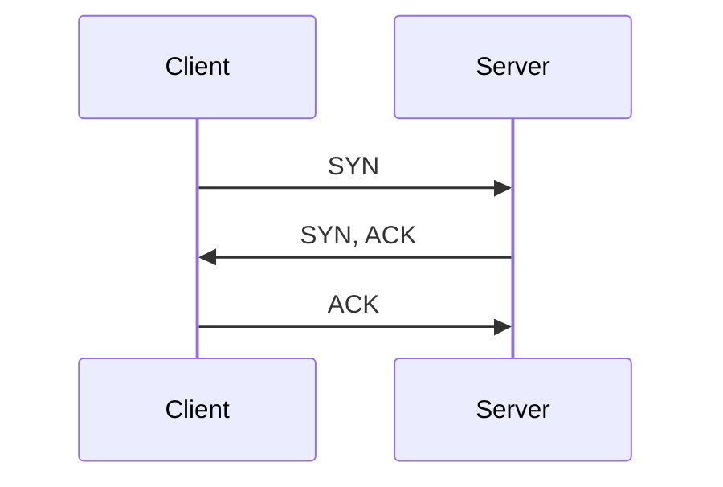
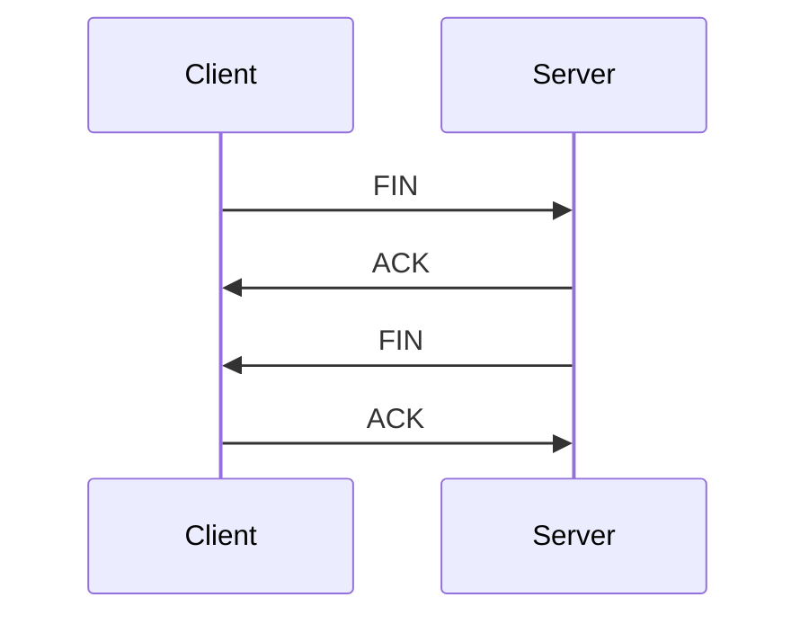

# 定义

TCP（Transmission Control Protocol）是一种在计算机网络中用于可靠传输数据的协议。TCP 使用三次握手建立连接和四次挥手终止连接，以确保数据的可靠传输。下面是 TCP 的三次握手和四次挥手的过程：

**三次握手（Three-Way Handshake）：** ^caa487

1. **第一步（SYN）：** 客户端发送一个 SYN（同步）包，将 Sequence Number 设置为一个随机值。这表示客户端请求建立连接。

2. **第二步（SYN + ACK）：** 服务器接收 SYN 包后，回复一个 SYN+ACK（同步和确认）包。服务器将自己的 Sequence Number 设置为另一个随机值，并将 ACK 设置为客户端发送的 Sequence Number + 1。这表示服务器接受了客户端的请求，并向客户端传达自己的请求建立连接。

3. **第三步（ACK）：** 客户端接收到服务器的 SYN+ACK 包后，发送一个 ACK（确认）包。客户端将 ACK 设置为服务器发送的 Sequence Number + 1，表示客户端确认了服务器的请求建立连接。

此时，双方都知道对方已准备好建立连接，连接已建立完成。

**四次挥手（Four-Way Handshake）：**

1. **第一步（FIN）：** 当客户端决定关闭连接时，它会发送一个 FIN（结束）包，表示不再向服务器发送数据。

2. **第二步（ACK）：** 服务器收到客户端的 FIN 包后，发送一个 ACK 包作为确认，告诉客户端它已收到关闭请求。

3. **第三步（FIN）：** 当服务器也准备好关闭连接时，它会发送一个 FIN 包，表示不再向客户端发送数据。

4. **第四步（ACK）：** 客户端收到服务器的 FIN 包后，发送一个 ACK 包作为确认，告诉服务器它已收到关闭请求。

此时，双方都知道对方准备关闭连接，连接已经成功终止。

这个三次握手和四次挥手的过程保证了在网络上建立和终止连接时的可靠性，确保数据能够正确地传输和释放。

# 三次握手和四次挥手流程图

**三次握手：**

**四次挥手：**

