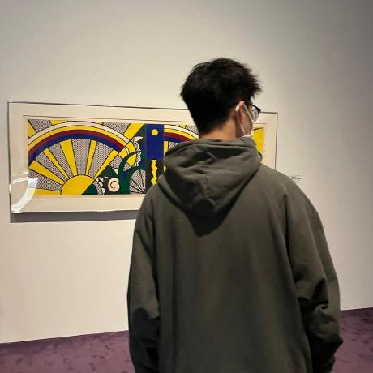

  

    

      

        
      

      张书睿的博客
      
不断精进

      

        

          

        

      

      

        嗨，我是张书睿，一名前端web开发者，现居南京，就职于育儿网，正在前端的浑水里摸爬打滚。
      

      

        

          

        

      

      

        寻找生活的平衡。
      

      
 0">
        
          <a href="https://github.com/https://github.com/ZhangShuRui" target="_blank"
            >Github</a
          >
        
        
          <a href="#README">开始阅读</a>
        
      

    

  

  

